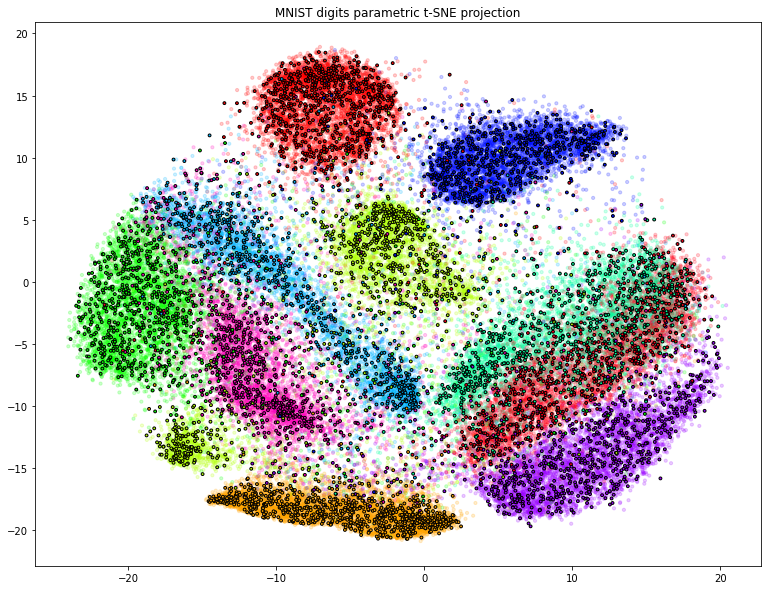

# parametric_tsne_pytorch
Implementation or regular and multiscale parametric t-SNE in pytorch

The code implements parametric t-SNE in Pytorch.

The demosntration is in the `Demonstration.ipynb` notebook

References:  

  * L.J.P. van der Maaten and G.E. Hinton. Visualizing High-Dimensional Data Using t-SNE. Journal of Machine Learning Research 9(Nov):2579-2605, 2008.
  * L.J.P. van der Maaten. Learning a Parametric Embedding by Preserving Local Structure. In Proceedings of the Twelfth International Conference on Artificial Intelligence & Statistics (AI-STATS), JMLR W&CP 5:384-391, 2009.
  * de Bodt, Cyril & Mulders, Dounia & Verleysen, Michel & Lee, John. (2018). Perplexity-free t-SNE and twice Student tt-SNE. 
